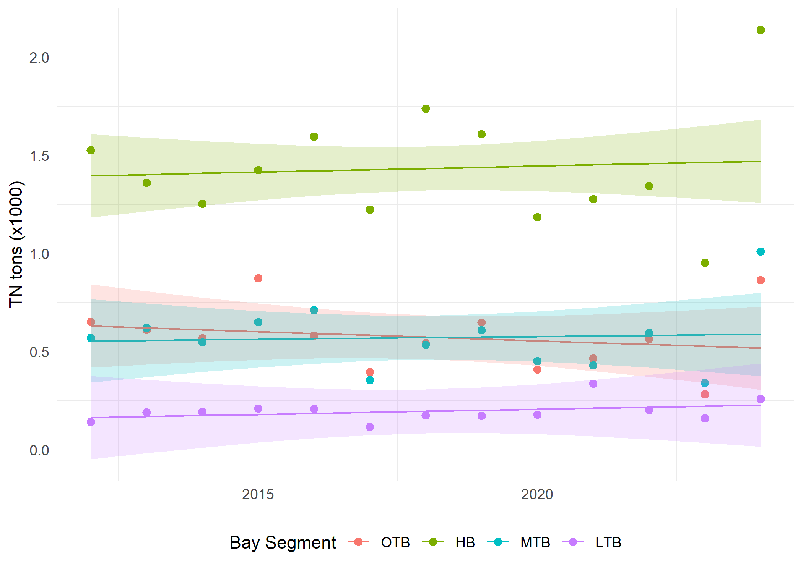

```{r}
#| eval: false
spelling::spell_check_files(here::here('revision/review_response.qmd'))
```

*We sincerely thank the editors and all reviewers for providing useful comments on our manuscript. We have made every effort to address these concerns. In particular, we have..... Please see the responses below (line numbers in responses refer to the revised manuscript).*

### Reviewer #1:

1\. Ln 180: It seems like it would be more relevant to the analysis of chlorophyll-a to analyze surface salinity, rather than averaging across all depths. Additional rationale should be given to justify this choice. Does interpretation of model output change if surface salinity rather than depth-averaged salinity is used? By including bottom salinity, is there greater aliasing of tidal variability in the monthly salinity data? Or is this accounted for during the cruise surveys (e.g., sampling at similar tidal stage across all cruises)?

*This is a valid comment and one that we considered during early analyses of the data.  As it turns out, the results in the current manuscript our actually from using surface salinity.  The text description of averaging by depth was mistakenly included from an earlier draft and we have corrected the text to indicate that only surface salinity was used.  Regardless, results using surface salinity vs depth-averaged were very similar and did not make a large difference for model performance.  Deviance explained of the GAMs for each bay segment were the same using surface or depth-averaged, the exception being LTB where deviance explained was 0.61 using surface values and 0.59 using depth-averaged.  So, there is an improvement in fit using surface values for LTB, but it is marginal.*

*The following was added for additional context: "Surface chlorophyll-a and salinity observations at each station were averaged by month for each bay segment (annual averages by bay segment are shown in Figure2a, b).  Salinity is measured at surface, mid, and bottom depths at each station, whereas only surface salinity was used for analysis given similar sampling depth as chorophyll-a.  Further, initial analyses using depth-averaged salinity produced models with nearly identical performance when compared to those using surface salinity. These similarities were not unexpected given that the majority of Tampa Bay is shallow, well-mixed, and typically does not stratify, as noted in the prior section."*

2\. For the "futures" scenario, linear regression is used to empirically estimate future salinity. However, for the loading, it's more of a sensitivity analysis approach, where the TMDL threshold is either halved or doubled. What is the justification for the choice of loading scenarios, rather than assuming long-term observed trends in loading will continue over the next 50 years? This is obviously unlikely if the decrease in load was due to one-time WWTP upgrades, but I think the choice still warrants further explanation as halving the load specified in the TMDL may also be an equally unlikely scenario depending on source, available BMPs, etc...

*Yes, we agree that the derivation of future loading scenarios doesn't align conceptually with our future scenarios for salinity.  Our target audience for this paper, beyond the typical academic readers, is resource managers and we thought it useful to present the loading scenarios in this general, more coarse context, rather than projected trends (or lack of, see below). The intent is to motivate action for OTB, i.e., do something now rather than continuing status quo activities that currently contribute to loading that is above the federal threshold.* 

*We also agree that the gross percentage changes (i.e., half TMDL, twice TMDL) may not represent realistic scenarios for the reasons the reviewer mentions.  However, we believe these assessments are useful as a thought exercise to put meaningful bounds on how "high" or "low" loading scenarios may affect the likelihoods of exceeding thresholds relative to changing salinities. In reality, loading has remained relatively constant for the contemporary period evaluated (2012-2024, although we acknowledge inter-annual variability), thus reinforcing the concept that the status quo may not be sufficient to protect water quality in the future.  The figure below shows current loading trends.  None of the individual regressions are significant and we've added a supplemental table with these results.*



*It's also worth pointing out that we used long-term salinity trends for the entire period of record (1975 to present) to develop the projections for future salinity.  Loading for the same period (1985, when estimates begin) also show a long-term decrease.  However, understanding recent loading trends (e.g., 2012 to present) is more relevant in a management context given time frames within which nutrient reduction interventions may infleunce water quality, whereas the long-term reduction in salinity is consistent and cannot be easily modified with conventional management approaches. Thus, our justification for why we are using a contemporary period to assess loading trends (or lack of) and why we are retaining our original loading scenarios is strictly to present results that are better contextualized to how managers may react to changing baselines.*

*In brief, we have added the following text to our description of the simulation scenarios (lines xxx - xxx): "Although long-term reductions in loading have been observed over several decades, evaluating upper and lower bounds of potential loads relative to the TMDL threshold for each bay segment provides a more contextualized assesssment.  While we recognize this does not represent a realistic scenario where loading is consistent fifty years into the future, the effects of gradual salinity changes can be more readily evaluated for fixed constants of loading.  Moreover, loadings have been relatively consistent since 2012 (the simulation period, Table S7) and emphasizing that the "status quo" may not remain protective in the future is also a worthwhile assessment.*

3\. Section 3.2: the value added by the salinity-normalized and salinity-normalized at mean loading is not immediately obvious. For example, lines 379 - 380 state "suggesting that salinity and/or loading were key drivers of chlorophyll-a that varied over time". Isn't that already previously inferred from Table 1 and the fact that salinity and interactions between loading and other variables uniquely explain deviance observed in chlorophyll-a? MTB and LTB did not have significant interactions between loading and other variables (Table 1), whereas HB and OTB did, and these are the segments where, "salinity-normalized results were similar to those at mean loading. This suggested that loading had more unique effects on chlorophyll-a in OTB and HB, whereas a loading effect could not be distinguished from salinity for MTB and LTB" (lines 383 - 386). The methodological description (section 2.3) and figures for the salinity-normalized results are a bit convoluted, while seemingly redundant of the findings of the original GAM. I think the motivation was to apply a WRTDS-like approach (Beck & Hagy, 2015) within a GAM framework but I'm not convinced that it enhances the findings of the paper.
 
*response* 

4\. Discussion: The relevance of the results regarding future changes in chlorophyll-a are limited by the fact that the authors didn't consider changes in temperature, which often has a first order effect on algal dynamics. If the salinity-normalized results were removed from the paper, it would allow for the concurrent effects of temperature and salinity to be modeled and discussed, which would strengthen the results/discussion regarding projected changes in chlorophyll-a.

*response* 

Specific Comments

1\. Ln 55: missing period before "similarly"

*Added.* 

2\. Ln 117: for conciseness consider changing to "freshwater inflows and circulation".

*Changed.* 

3\. Ln 141: Consider adding bathymetry data to Figure 1 (if available) to accompany description

*Bathymetry was added to the figure, in addition to some legend items to make the elements more readable.* 

4\. Ln 149: Add reference to Figure 2.

*The loading data in Figure 2 begins in 1985 and does not provide a comparison to those from the 1970s "worst-case" scenario.  We have added a citation to the historical document from which those estimates were obtained and the current for comparison [@tbep0494; @janicki23].*

5\. Consider moving the last paragraph in methods (ln 158 - 175) to the introduction.

*This paragraph was moved to the second to last paragraph of the introduction.* 

6\. Ln 213- 215: Add a citation to show this is a previously documented approach for dealing with long-term change as well as seasonal variability in the time component. 

*A citation to @beck2022b was added since this was the origin of the concept.* 

7\. Ln 227 - 229: the justification for assuming a gamma distribution should be elaborated further

*Text was added about justification for the distribution and a table showing a comparison of Gaussian/log-link with the existing Gamma models was included in supplement.*
 
*"Models using a Gaussian distribution with a log-link function were also evaluated, although using a Gamma distribution was superior when compared with Akaike information criterion [@akaike1974, Table S1]."* 

8\. Ln 269: minimum and maximum observed over what time-period?

*Text was modified to "minimum and maximum observed over the period of record for each bay segment".* 

9\. Ln 274: over what time period was the mean loading computed?

*This was also the mean loading for the period of record for each bay segment, similar to salinity.  Text was modified similarly as the previous response.* 

10\. Ln 322: Are the chlorophyll-a thresholds defined in FDEP's water quality standards? It would be helpful to clarify where these numbers come from. Citing Figure 2, which shows the relevant regulatory criteria would likely be sufficient.

*Yes, the chlorophyll-a thresholds are FDEP standards under the bay's Reasonable Assurance Plan. A citation to Figure 2 was included and "regulatory" was added as a text qualifier for the chlorophyll-a thresholds.* 

11\. Ln 349: Is the lower percent explained in LTB due to aliasing of tidal variability in salinity data since the data was depth-averaged?

*Please see our response to the first general comment.* 

12\. Ln 353 - 356: I believe this is determined by the p-value, which should be clarified in the text.

*Yes, this is correct, although we note that the journal discourages general statements about p-values.  We revised the sentence to include more detail about these main effects: "All bay segments had individual smoothers for decimal time, day of year, and salinity that explained a unique portion of the variance in chlorophyll-a (Table 1), although the defined relationships varied from linear (estimated degrees of freedom, edf = 1; e.g., decimal time for OTB, salinity for OTB and HB) to highly non-linear (edf >> 1; day of year for all bay segments)."* 

13\. Ln 365 - 367: Is this because the water column is less stratified? Or because there is less episodic variation in the load, which decreases the likelihood of aliasing higher frequency variability due to storms? In general, some of the trends in model-data agreement across segments are not particularly surprising given the model setup.

*Since stratification does not occur regularly in Tampa Bay, the decreased fit in the wet season is likely due to higher variability in chlorophyll-a and additional factors beyond those included in the model that could influence primary productivity. Conversely, it is very possible that chlorophyll-a during the dry season is captured more fully by the time variables in the model (decimal time, day or year) as other parameters have less of an influence outside of the growing season.  We agree, though, that these results are not particularly surprising but it is worth explaining times when the models performed better or worse to help the reader understand factors that could influence chlorophyll-a dynamics.* 

14\. Figure 5: Consider showing the effect plots for the original GAM instead of the salinity-normalized analysis.

*We retain figure 5 because it is central to the second objective of the paper to identify how these models can be used to disambiguate the individual effects of salinity and loading, particularly over time as in the current figures (the effects plots from standard GAM output show the effects across the range of the parameters, not time).  However, we have included conventional GAM effects plot for each model in the supplement to help the reader better visualize the smoothers and their interactions (Figures S2 and S3).* 

15\. Figure 6: Consider making the x- and y-axis scales the same for the different segments because the e.g., stronger loading effect in OTB/HB isn't immediately obvious. Also, are the lines necessary since the points are color-coded? You could instead use a color gradient to represent year as in Figure 3. This would lessen the need to have year labels, which should be described in the caption if included.

*For subfigure (a), we retain the separate scaling for each bay segment because we feel it is important to help visualize differences between years for each bay segment. However, we have removed the path connection between years to help declutter the plot.  For subfigure (b), the axes are now fixed to better emphasize scale comparisons between sub-segments. The caption was updated to describe this rationale: "The axis scales are not fixed in (a) to better visualize inter-annual changes within each bay segment, whereas the scales are fixed in (b) to emphasize differences in the magnitude of the drivers between bay segments.".  Regarding color, we feel that using these broad annual groupings helps visually discriminate temporal shifts in drivers of chlorophyll (salinity v loading) and the categories align with other comparisons throughout the manuscript (i.e., tables 2 and 3, simulation time period), so they are retained as is.* 

16\. Ln 554-55: Is high salinity attributable to high tidal exchange given the monthly data doesn't resolve tidal variability? Or is it that the salinity is higher during the dry season? (this explanation seems more consistent with the sentences that follow).

*Yes, this sentence is a little misleading given those that follow.  We removed the part about tidal exchange and just shortened the sentence to "The opposite could be true during periods of high salinity (...". As is the premise of this paragraph, the specific causal mechanism for which salinity serves as a proxy cannot be known without additional data.  Our interpretation in this paragraph elucidates some potential reasons to allow the reader to make a more informed assessment as to how multiple factors influence phytoplankton growth. Salinity is simply a rough proxy for these drivers, as stated throughout.* 

### Reviewer #2:

The authors build a Generalized Additive Models (GAMs) to model chlorophyll-a as a function of time, salinity, nutrient load and their derivative to understand historical relationship as well as project future potential management actions that may be needed in Old Tampa Bay, Florida, USA.

The paper has a clear objective, analysis and conclusion to support the findings. My main concern is the lack of Exploratory Data Analysis (EDA) to not only justify the model but provide readers with potential transferability contribution to other areas of the world. Even leaving out other variables that may explain chlorophyll-a, there was no justification as to the form of preselected variables. On Line 220- 222, the authors say, "no efforts were made for carriable section since the same model structure for describing drivers and scenario testing between bay segments was desired (objective 2 and (3)". There is an issue in this statement, because it implies that as long as one is interested in potential differences (between historical and some future time of a variable), how one came up with the model has less influence. In addition, the justification to say what is done is what is mentioned in the objective seems difficult reasoning to follow. Yes, it is important to address what is promised in the objective, but if the objective needs to be relaxed to put EDA in the work, I would suggest it should be.

*response* 

Other minor comments are 1) Given the lack of documented EDA, I am not sure about the value of two-time variables. Both are basically taking care of seasonality. The same is true with interaction terms. What are the justifications for those terms? 2) Line 68 to 70 says "This study is an explicit follow-up to Beck et al. (2024) by providing a quantitative assessment of the relative risk of exceeding regulatory standards under future climate change." I did not see any analysis support for this statement. Please include supporting material or remove it.
Overall, this is a great study and could be improved by adding some form of EDA that readers can take away from this study.

*response* 

## References